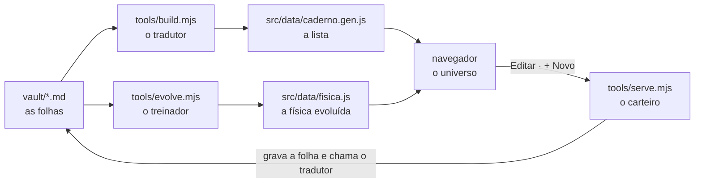

# Guia do Caderno para quem pensa em Python

Este guia explica o projeto inteiro em três camadas: primeiro como se você
tivesse 8 anos, depois o mapa das peças, e por fim cada peça traduzida para
Python. Ao voltar ao projeto depois de um tempo, comece por aqui.

---

## 1. Explicado para uma criança de 8 anos

Imagine um **caderno de papel** onde cada folha é um assunto que você está
estudando: "MCP", "Attention", "Idempotência". As folhas ficam em gavetas
(Engenharia de IA, Arquitetura), e dentro das gavetas há divisórias (Agentes,
Modelos, Dados…). Quando um assunto lembra outro, você amarra as duas folhas
com um **barbante**.

Agora imagine que alguém joga todas essas folhas no espaço, cada uma virando
uma **bolinha**, e os barbantes viram **elásticos**. Duas regras mandam em
tudo:

- as bolinhas **se empurram**, como ímãs virados do mesmo lado;
- os elásticos **puxam** as bolinhas amarradas para perto.

Quando as duas forças se equilibram, o caderno vira um **universo**: assuntos
parecidos ficam juntos e as gavetas viram continentes de cor. É isso que você
vê na tela.

O projeto tem cinco personagens:

| personagem | quem é no código | o que faz |
|---|---|---|
| **o caderno** | a pasta `vault/` | guarda as folhas, uma por arquivo `.md` |
| **o tradutor** | `tools/build.mjs` | lê as folhas e escreve uma lista que o navegador entende |
| **o universo** | o navegador (`src/`) | desenha as bolinhas e faz a física acontecer |
| **o carteiro** | `tools/serve.mjs` | quando você clica em Salvar, leva o texto até a folha certa |
| **o treinador** | `tools/evolve.mjs` | testa muitos universos, fica com os melhores e descobre a física mais bonita |

O treinador merece um parágrafo. Ele cria 24 universos com forças diferentes
(ímãs mais fortes, elásticos mais curtos…), dá uma nota a cada um e deixa os
melhores "terem filhos": misturam suas forças e mudam um pouquinho. Depois de
30 gerações, os filhos são bem melhores que os pais. Isso é um **algoritmo
genético**.

---

## 2. O mapa



Três caminhos passam por esse mapa:

1. **Ler.** `vault/` → tradutor → lista → navegador desenha.
2. **Escrever.** Você edita no painel → o carteiro grava o `.md` → roda o
   tradutor de novo → o navegador atualiza a nota e as arestas na hora.
3. **Evoluir.** O treinador lê o `vault/`, testa milhares de universos sem
   abrir o navegador, e grava a melhor física em `src/data/fisica.js`.

A regra de ouro: **o `.md` é a fonte da verdade.** Tudo o mais é derivado dele
ou é resultado de um experimento.

---

## 3. JavaScript traduzido para Python

JavaScript roda em dois lugares aqui: **no navegador** (tudo em `src/`) e **no
terminal**, pelo Node (tudo em `tools/`). O Node é para o JavaScript o que o
interpretador `python` é para o Python.

| JavaScript | Python | observação |
|---|---|---|
| `node tools/build.mjs` | `python tools/build.py` | rodar um script |
| `import { x } from './a.js'` | `from a import x` | o caminho do arquivo é explícito |
| `export function f()` | uma função pública do módulo | sem `export`, a função é privada |
| `const x = 1` / `let y = 2` | `x = 1` | `const` não pode ser reatribuída; `let` pode |
| `(x) => x * 2` | `lambda x: x * 2` | a "arrow function", usada por toda parte |
| `{ a: 1, b: 2 }` | `{"a": 1, "b": 2}` | objeto ≈ dict |
| `[1, 2, 3]`, `.map(f)`, `.filter(f)` | `[1, 2, 3]`, `[f(x) for x in …]` | array ≈ list |
| `new Map()`, `new Set()` | `dict()`, `set()` | |
| `for (const n of nodes)` | `for n in nodes:` | atenção: `for…in` em JS é outra coisa |
| `a === b` | `a == b` | em JS use sempre três `=` |
| `` `olá ${nome}` `` | `f"olá {nome}"` | template string ≈ f-string |
| `obj?.campo` | `getattr(obj, "campo", None)` | não quebra se `obj` for vazio |
| `async` / `await` | `async` / `await` (asyncio) | mesma ideia |
| `JSON.stringify` / `JSON.parse` | `json.dumps` / `json.loads` | |
| `Math.random()` | `random.random()` | |
| `mulberry32(42)` (em `src/params.js`) | `random.Random(42)` | gerador com semente |
| `node --test` | `pytest` | os testes ficam em `test/` |
| `package.json` → `scripts` | `pyproject.toml` / `Makefile` | atalhos: `npm run evolve` |
| `requestAnimationFrame(frame)` | `while True: …; clock.tick(60)` | o laço de jogo do pygame |
| `canvas` | uma `Surface` do pygame | onde se desenha pixel a pixel |
| `el.addEventListener('click', f)` | `botao.bind("<Button-1>", f)` (tkinter) | "quando clicar, chame f" |

Um padrão que aparece em quase todo arquivo: em vez de classes, as funções
**devolvem um objeto com outras funções dentro**.

```js
export function createSimulation(graph, opts) {
  const P = { ...PARAMS, ...opts.params };   // estado guardado aqui dentro
  function step(dt) { /* usa P */ }
  return { step };
}
const sim = createSimulation(graph, {});
sim.step(1);
```

Em Python isso é um *closure* — e se comporta como uma classe com `self.P`:

```python
def create_simulation(graph, params):
    P = {**PARAMS, **params}
    def step(dt):
        ...          # usa P
    return {"step": step}
```

---

## 4. As peças, uma por uma

### A física (`src/physics.js`)

A cada frame (60 por segundo), quatro forças mexem na velocidade de cada
bolinha. Em Python, sem otimização, o coração seria:

```python
def passo(nos, arestas, P):
    for n in nos:                                   # 1. gravidade: puxa para o centro
        n.vx -= n.x * P["GRAVITY"]
        n.vy -= n.y * P["GRAVITY"]

    for a, b in itertools.combinations(nos, 2):     # 2. repulsão: todo mundo se empurra
        dx, dy = b.x - a.x, b.y - a.y
        d2 = max(dx * dx + dy * dy, 1.0)
        d = d2 ** 0.5
        f = P["REPULSION"] * a.massa * b.massa / d2  # como a gravitação, mas empurrando
        a.vx -= dx / d * f / a.massa;  a.vy -= dy / d * f / a.massa
        b.vx += dx / d * f / b.massa;  b.vy += dy / d * f / b.massa

    for l in arestas:                               # 3. molas: lei de Hooke
        dx, dy = l.b.x - l.a.x, l.b.y - l.a.y
        d = math.hypot(dx, dy) or 0.01
        f = (d - l.repouso) * P["SPRING"]           # esticada puxa, comprimida empurra
        l.a.vx += dx / d * f / l.a.massa;  l.a.vy += dy / d * f / l.a.massa
        l.b.vx -= dx / d * f / l.b.massa;  l.b.vy -= dy / d * f / l.b.massa

    for n in nos:                                   # 4. atrito, e anda
        n.vx *= P["DAMPING"];  n.vy *= P["DAMPING"]
        n.x += n.vx;           n.y += n.vy
```

Além disso, há três detalhes:

- **O "boom" do começo:** um empurrão para fora do centro nos primeiros 2,6 s.
- **A respiração:** uma oscilação pequena e permanente em cada nó; sem ela, o
  universo congelaria depois de assentar.
- **A âncora:** a raiz "Caderno" fica sempre no centro.

O custo é O(n²): todo par de bolinhas é visitado. Com 77 nós são ~3 mil pares
por frame, o que não pesa nada. Acima de uns 400 nós, o caminho seria
Barnes-Hut (uma quadtree).

### O tradutor (`tools/build.mjs` e `tools/lib/`)

Em Python seria algo como:

```python
for arquivo in Path("vault").rglob("*.md"):
    if arquivo.name.startswith(("_", ".")): continue
    frontmatter, corpo = separar_yaml(arquivo.read_text("utf-8"))
    nota = {"slug": frontmatter["slug"], "status": frontmatter["status"],
            "html": markdown_para_html(corpo)}
    arestas += [(nota["slug"], alvo) for alvo in re.findall(r"\[\[(.+?)\]\]", corpo)]
Path("src/data/caderno.gen.js").write_text("export const CADERNO = " + json.dumps(arvore))
```

O leitor de YAML e o conversor de Markdown foram escritos à mão, em
`tools/lib/frontmatter.mjs` e `tools/lib/markdown.mjs`. É o mesmo espírito do
micrograd: um subconjunto pequeno e testado, em vez de uma biblioteca inteira.

### O carteiro (`tools/serve.mjs`)

É o equivalente a um servidor Flask com três rotas:

```python
@app.get("/api/nota")
def ler(slug):   return {"corpo": ler_md(slug), "status": ...}

@app.put("/api/nota")
def gravar(slug, corpo, status):
    escrever_md(slug, corpo, status)     # preserva o frontmatter
    reconstruir()                        # roda o tradutor de novo
    return {"html": ..., "arestas": ...}

@app.post("/api/nota")
def criar(pai, nome):
    plano = planejar(pai, validar(nome)) # onde nasce; se o pai é tópico, vira pasta
    try:
        executar(plano)                  # move, cria o .md
        reconstruir()
    except Exception:
        desfazer(plano)                  # o vault nunca fica ilegível
        raise
    return {"nota": ..., "arvore": ...}
```

As regras de nome e o plano ficam em `tools/lib/criar.mjs`, sem tocar no
disco — por isso dá para testá-las sem montar um vault.

Além disso, ele serve os arquivos do site. Por segurança, só aceita conexões
da sua própria máquina e só grava dentro de `vault/`.

### O treinador (`tools/evolve.mjs` e `tools/lib/genetico.mjs`)

```python
pop = [tuple(random.random() for _ in range(8)) for _ in range(24)]   # 8 genes em [0, 1]
for geracao in range(30):
    nota = {g: avaliar(g) for g in pop}      # roda a física 40 s e mede o layout
    pop.sort(key=nota.get, reverse=True)
    proxima = pop[:2]                        # elitismo: os 2 melhores passam intactos
    while len(proxima) < 24:
        pai, mae = torneio(pop, nota), torneio(pop, nota)
        proxima.append(mutar(cruzar(pai, mae)))
    pop = proxima
```

A nota (`tools/lib/aptidao.mjs`) mede cinco coisas no universo assentado:
arestas que se cruzam, domínios misturados, nós colados, se cabe na tela, e se
parou de tremer.

O detalhe que mais importa é que a avaliação usa **treino, validação e teste**,
como qualquer ML. A nota é ruidosa, e sem essa separação o algoritmo premiava
genomas que só tiveram sorte. O resultado completo está em
`evolucao/relatorio.html`.

### O universo na tela (`src/`)

| arquivo | faz |
|---|---|
| `main.js` | liga tudo e roda o laço de 60 frames por segundo |
| `graph.js` | transforma a árvore de notas em bolinhas e elásticos |
| `physics.js` | as forças (acima) |
| `params.js` | os 8 números da física manual, e o gerador com semente |
| `render.js` | desenha no canvas: fundo, arestas, bolinhas, rótulos |
| `panel.js` | o painel lateral que abre ao clicar num nó |
| `editor.js` | o modo Editar/Salvar do painel |
| `criador.js` | o botão + Novo e o formulário de nota nova |
| `interaction.js` | mouse, toque e teclado |
| `viewport.js` | a câmera: zoom e posição |
| `palette.js` | as cores, lidas do CSS |

---

## 5. Quero mudar X — abro Y

| quero… | abro |
|---|---|
| escrever uma nota | o caderno no navegador → Editar |
| criar um assunto novo | no caderno: clique no nó onde ele se encaixa → **+ Novo tópico** |
| criar um domínio novo (Python, ML…) | no caderno: clique na raiz → **+ Novo domínio** |
| ligar dois assuntos | escrevo `[[Nome da nota]]` no texto |
| mudar o que conta como "bonito" | `PESOS` em `tools/lib/aptidao.mjs`, depois `npm run evolve` |
| mudar as faixas dos genes | `GENES` em `tools/lib/genetico.mjs` |
| mudar cores | `styles/style.css` (tokens no topo) |
| mudar a física na mão | `src/params.js` |

---

## 6. Comandos

```bash
node tools/serve.mjs            # abre o caderno em http://localhost:5173 — o dia a dia
node --test                     # roda os testes
node tools/evolve.mjs           # evolui a física (~5 min); --rapido para ~1 min
node tools/bundle.mjs           # gera dist/caderno.html, que abre com dois cliques (só leitura)
git add vault && git commit -m "notas" && git push
```

No Windows, se `node` não for reconhecido no terminal:
`$env:Path += ";C:\Program Files\nodejs"`.

---

## 7. Para onde vai o Python

A decisão tomada: **JavaScript fica com a visualização; o ML sobre o texto das
notas vai para Python.** A fronteira entre os dois é **um arquivo**, nunca um
servidor. É o mesmo padrão do `fisica.js`: um script Python lê `vault/`,
calcula, e grava algo como `src/data/sugestoes.json`, que o site só lê.

O algoritmo genético é a exceção que fica em JavaScript. Ele precisa rodar
exatamente a mesma física que desenha a tela; portá-lo obrigaria a manter duas
cópias da física sincronizadas.

Primeira tarefa candidata para o Python: sugerir arestas entre notas
parecidas, com um TF-IDF escrito do zero — quando houver umas 20 ou 30 notas
escritas.
